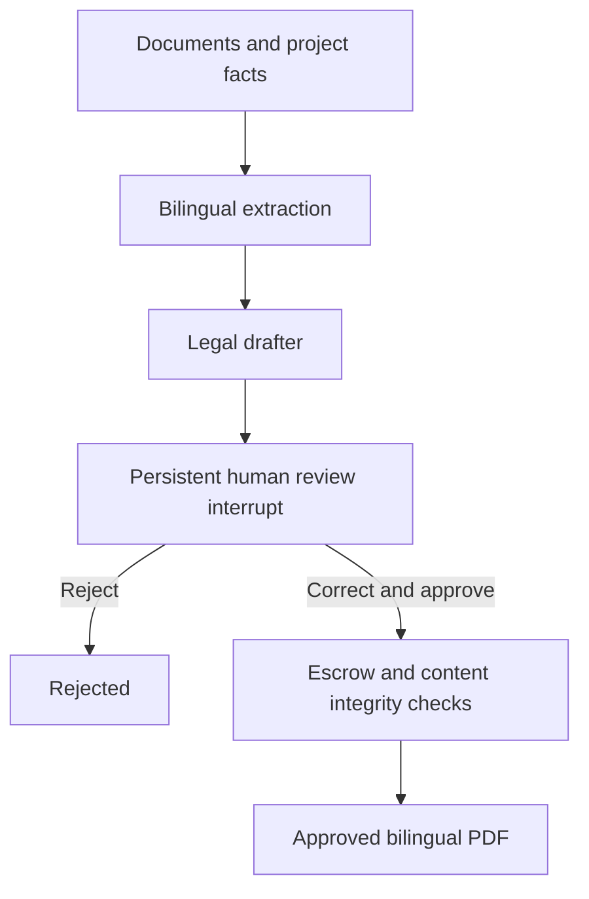

# Emtethal — KSA off-plan contract review

A runnable, single-company pilot using **FastAPI + LangGraph**, with a bilingual web review desk. This is the standalone Real Estate Emtethal project.

## Run

```bash
cd real_state_emtethal
cp .env.example .env
# Replace both API keys in .env with different random secrets.
docker compose up --build
```

Open http://localhost:8000. Paste the analyst key, upload `config/example-evidence.txt`, and click **Extract & draft**. Replace the access key with the compliance-officer key to approve or reject. Saved contracts can be reopened after a restart.

The default clause bundle is deliberately incomplete. For a **synthetic demo only**, replace every `REVIEW_REQUIRED` clause and reference with test wording, tick the review attestations, enter a review note and synthetic escrow reference, and approve. The PDF is watermarked `DEMONSTRATION - NOT FOR SIGNATURE`. Never replace placeholders with test wording for an actual transaction.

Local Python 3.12 alternative (install Pango and DejaVu Sans first):

```bash
python -m venv .venv
source .venv/bin/activate
pip install -r requirements.txt
set -a
source .env
set +a
uvicorn app.main:app --host 127.0.0.1 --port 8000 --workers 1
```

The shell `.env` loader assumes a trusted, locally maintained file. Do not source a file from an untrusted party.

## Workflow



- **Extraction:** page-attributed text from PDF/TXT; live image transcription for PNG/JPEG. The model produces bilingual summaries, verbatim evidence quotations and unresolved issues. Fabricated evidence quotations fail validation. Structured project variables are supplied and corrected by humans rather than silently populated from uncertain extraction.
- **Drafting:** structured LLM output plus server-controlled mandatory clause text. The model cannot change supplied structured facts or mandatory source clauses. The legal reviewer can edit both languages and structured facts, but cannot change the project identity.
- **HITL:** `interrupt()` persists state through SQLite checkpoints. An authenticated compliance-officer decision resumes the same thread with `Command(resume=...)`. Approval requires legal, language-equivalence and source-verification attestations.
- **Finalization:** validates Saudi IBAN checksum, exact match to the project registry, license match, clause categories, resolved placeholders and approved-content hash. The PDF is rendered from the reviewed snapshot; there is no post-approval LLM rewrite.
- **Audit:** timestamped creation/decision hashes plus full decision in the durable graph checkpoint. The checkpoint is authoritative if a crash occurs between graph and audit database commits. This is not an external tamper-proof audit service.

## Legal configuration and limits

This is drafting/review software, **not an assertion of WAFI/REGA compliance**. The ten clause categories are an engineering review checklist, not a certified or exhaustive list of Saudi mandatory clauses. There is no hardcoded statutory penalty percentage.

Before real use, a qualified Saudi legal reviewer must prepare a complete Arabic/English clause bundle and identify the applicable legal instrument, article, version and approved contract template for each clause. Set:

- `LLM_MODE=live`, `OPENAI_API_KEY`, and a model supporting structured output (and vision if images are used).
- `CLAUSE_BUNDLE` to an independently reviewed JSON file using the demo bundle's schema, with `demo: false`, a version, `approved_by`, and complete clauses.
- `PROJECT_REGISTRY` to an independently verified project registry with `_demo: false`, project license, escrow IBAN, `verified: true`, and a bank/project evidence reference. Keep this read-only to ordinary reviewers.

For Docker, mount those files read-only and use their **container paths** in the environment. The application snapshots the bundle and registry at contract creation so review can be reproduced. Create a new contract if either governing record changes before approval.

An IBAN checksum and registry match do not verify account ownership with a bank. A reviewer must check bank evidence. Clause presence does not prove substantive validity or translation equivalence. PDF signing, official registration, REGA licensing verification, escrow bank APIs and Ejar submission are not implemented.

**WAFI sale** is the only enabled contract framework. Ejar ordinary rental contracts and off-plan leases need distinct, counsel-approved workflows; the API rejects unsupported frameworks rather than applying sale clauses to them.

## Sources checked 2026-09-25

- [REGA — Off-Plan Sales and Lease](https://rega.gov.sa/en/rega-services/platforms/wafi-off-plan-sales-and-lease/): licensing documentation, handover dates, feasibility documentation, and project escrow agreement requirements. This overview is not a complete contract template or substitute for the governing law and implementing regulations.
- [Ejar — The Standard Contract](https://www.ejar.sa/en/agreement/283): rental contract information and standard terms; treated separately from the sale flow.
- [LangGraph interrupts](https://docs.langchain.com/oss/python/langgraph/interrupts): persistent thread IDs, checkpoints, interrupt/resume and replay semantics.

## API for Flutter Web/Desktop or other clients

Use `Authorization: Bearer <key>`. OpenAPI documentation: `/docs`.

| Endpoint | Purpose | Role |
|---|---|---|
| `POST /api/documents` | Multipart `file` upload | Analyst/officer |
| `POST /api/contracts` | Start graph with `facts`, `document_ids` | Analyst/officer |
| `GET /api/contracts` | Last 100 saved contracts | Analyst/officer |
| `GET /api/contracts/{id}` | Draft, extraction, revision, waiting state | Analyst/officer |
| `POST /api/contracts/{id}/review` | Corrected draft, attestations, approve/reject | Officer |
| `GET /api/contracts/{id}/audit` | Decision history and checkpoint approval | Officer |
| `GET /api/contracts/{id}/pdf` | Reviewed PDF only | Analyst/officer |

Review JSON is documented by `Approval` in `app/models.py`. Send `expected_revision` from the fetched draft. `409` means stale or already-decided state. `422` means validation failed; the interrupt remains available for correction. Rejected agreements are terminal; create a new run for a replacement. No background jobs or push notification transport is implemented: the included web client waits for generation, and other clients can poll `GET` for status.

## Tests

```bash
pytest -q
```

Tests cover checkpoint persistence across application restart, no PDF before approval, officer authorization, rejection, duplicate/concurrent approval, stale revision, unresolved clauses, missing categories, IBAN/license/project mismatch, upload validation and bilingual PDF generation. LLM structured-output behavior is tested with mocks; a paid live provider call is not part of the test suite.

## Deployment boundaries

- Local, single-company pilot; all holders of an authenticated company key share access to its documents. Role keys identify the role, not an individual. Before multi-user deployment, add OIDC/SSO, per-person identity, tenant/project permissions and key rotation.
- Use one Uvicorn worker and a persistent local volume. Reviews use SQLite cross-process locks; use Postgres checkpoints, a job queue, idempotency keys and per-run locks before scaling generation.
- Generation is synchronous and provider errors return a contract ID. Failed generation needs a new run. A persisted review survives process restart.
- Uploaded text and graph state contain sensitive data. Configure retention, backup, encryption and approved regional/provider handling before real documents. Live mode sends document text/images to the configured model provider. Demo mode makes no model calls.
- File bounds: 20 MiB, 30 PDF pages, 80k characters/document, 120k characters/run. Production upload handling additionally needs a reverse-proxy body limit, malware scanning and isolated document parsers.
- Image transcription is not an engineering interpretation of scale, dimensions or CAD/BIM geometry. Scanned PDFs are rejected with an OCR instruction; DWG/IFC files are unsupported. Original bytes are not retained; source hashes, extracted pages and names are retained. Keep original evidence in your governed document store.
- Approved PDFs contain signature lines, not digital signatures. Marketing collateral and feasibility-report generation are future modules, not included endpoints.
- Serve behind TLS; do not expose the pilot's shared-key interface directly to the public internet.

## Android application

The native Kotlin/Jetpack Compose client is in [`android/`](android/README.md). Open that folder in Android Studio after running `sh bootstrap-gradle.sh`. It supports Arabic-first contract creation, uploads, bilingual editing, human approval/rejection and authenticated PDF saving. See its README for emulator/USB connection instructions. GitHub Actions builds a debug APK when the Android build succeeds.
